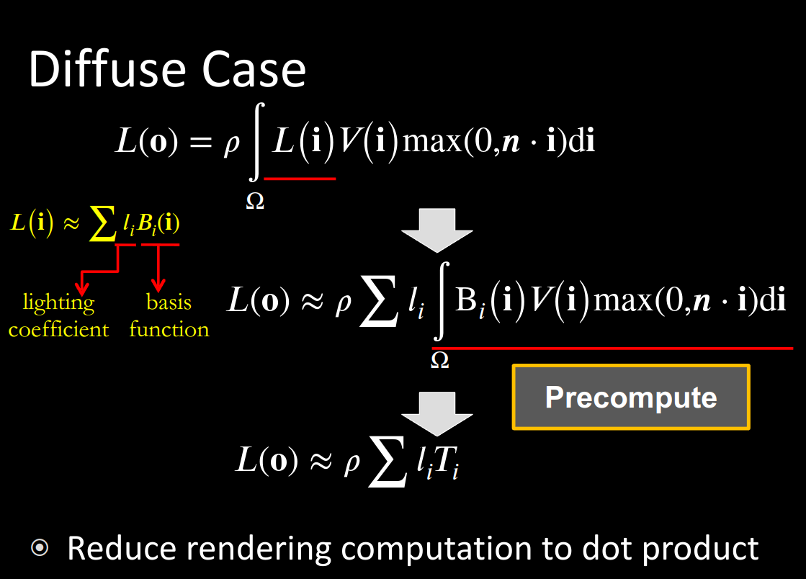
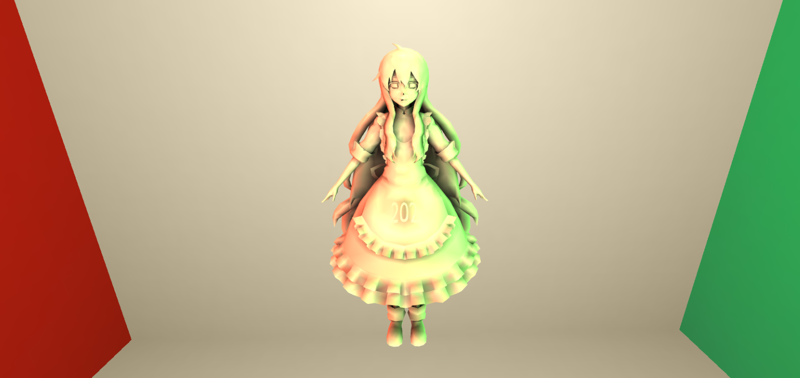
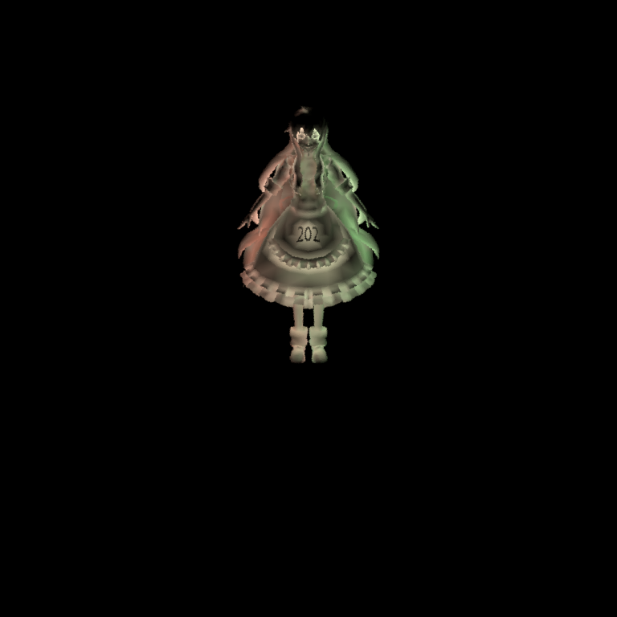
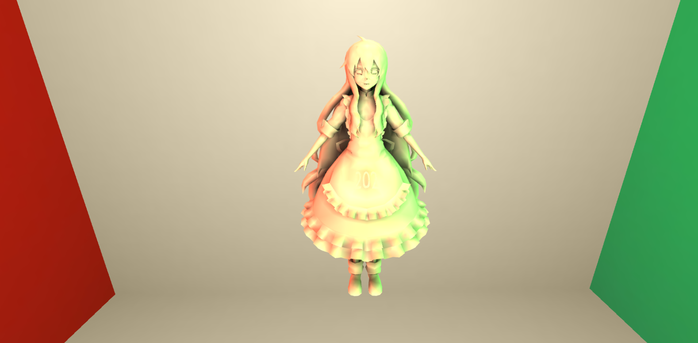

#! https://zhuanlan.zhihu.com/p/710289078


## 作业总览

1. 预计算球谐系数
    - 计算环境光投影到球谐函数上的系数
    - 计算对于unshadowed diffuse材质下传输球谐系数
    - 计算对于shadowd diffuse材质下的传输球谐系数
    - 计算对于interreflection diffuse材质下的传输球谐系数(bonus1)
2. 实时球谐光照计算
3. 环境光球谐旋转(bonus2)

## 代码实现

### 环境光球谐系数

```cpp
//prt.cpp
constexpr int SHNum = (SHOrder + 1) * (SHOrder + 1);
std::vector<Eigen::Array3f> SHCoeffiecents(SHNum);
for (int i = 0; i < SHNum; i++) SHCoeffiecents[i] = Eigen::Array3f(0);
float sumWeight = 0;
for (int i = 0; i < 6; i++) {
   for (int y = 0; y < height; y++) {
       for (int x = 0; x < width; x++) {
           // TODO: here you need to compute light sh of each face of
           // cubemap of each pixel
           // TODO: 此处你需要计算每个像素下cubemap某个面的球谐系数
           Eigen::Vector3f dir =
               cubemapDirs[i * width * height + y * width + x];
           int index = (y * width + x) * channel;
           Eigen::Array3f Le(images[i][index + 0],
                             images[i][index + 1],
                             images[i][index + 2]);
           // Eigen::Array3f Le(1, 1, 1 / (2 * sqrt(M_PI)));
           // 球谐系数计算
           for (int l = 0; l <= SHOrder; l++) {
               for (int m = -l; m <= l; m++) {
                   float sh = sh::EvalSH(l, m, dir.cast<double>());
                   float weight = CalcArea(x, y, width, height);
                   SHCoeffiecents[sh::GetIndex(l, m)] +=
                       sh * Le * weight;
               }
           }
       }
   }
}
return SHCoeffiecents;

```

该功能实现讲义讲的算很清楚了，注意讲义中积分离散化后公式中的$\Delta \omega_i$它对应的是一个立体角微元，
代码中提供了 CalcArea() 函数计算给定cubemap上对应的像素位置所对应的立体角面积，因为整个立方体的六个面
在球面投影时空间上是完全对称和等价的，即不管哪一个面，只要像素位置(x,y)定下来其所对应的立体角微元面积都是一样的，
所以调用CalcArea()函数时不用考虑哪一个面，只用考虑面上的相对位置.

此外为了进行debug，可以假设环境光是一个常数，看看积分后的结果和理论结果是否相互照应。

### diffuse unshadowed 和 shadowed 传输球谐系数计算



```cpp
//prt.cpp
// Projection transport
m_TransportSHCoeffs.resize(SHCoeffLength, mesh->getVertexCount());
fout << mesh->getVertexCount() << std::endl;
for (int i = 0; i < mesh->getVertexCount(); i++) {
   const Point3f &v = mesh->getVertexPositions().col(i);
   const Normal3f &n = mesh->getVertexNormals().col(i);
   // const mesh->getBSDF();
   auto shFunc = [&](double phi, double theta) -> double {
       Eigen::Array3d d = sh::ToVector(phi, theta);
       const auto wi = Vector3f(d.x(), d.y(), d.z());
       if (m_Type == Type::Unshadowed) {
           // TODO: here you need to calculate unshadowed transport
           // term of a given direction
           // TODO:
           // 此处你需要计算给定方向下的unshadowed传输项球谐函数值
           // 计算wi
           // 和法线n的点乘，如果点乘大于0，返回点乘结果，否则返回0

           return std::max(0.0, (double)wi.dot(n));
       } else {
           // TODO: here you need to calculate shadowed transport term
           // of a given direction
           // TODO: 此处你需要计算给定方向下的shadowed传输项球谐函数值
           // 查看顶点v方向为d的射线是否和场景中的物体相交
           Ray3f ray(v, wi);
           Intersection its;
           bool Ishit =
               scene->getAccel()->rayIntersect(ray, its, true);
           // 检查光线是否被物体阻挡
           if (Ishit) {
               // 如果光线被物体阻挡，返回0
               return 0;
           } else {
               // return std::max(0.0, (double)wi.dot(n)) * 0.5 / M_PI;
               return std::max(0.0, (double)wi.dot(n)) * 0.5;
           }
       }
   };
   auto shCoeff = sh::ProjectFunction(SHOrder, shFunc, m_SampleCount);
   for (int j = 0; j < shCoeff->size(); j++) {
       m_TransportSHCoeffs.col(i).coeffRef(j) = (*shCoeff)[j];
   }
```

上图中的 Precompute所勾选的部分是本次代码需要实现的部分，注意图中公式的$\rho$是albedo反照率，表明
材质反射rgb三基色光的基本属性，是个常数，可以提出来，它的值在Scene类中包含的Mesh网格类的BSDF属性中，该属性属于
mesh本身的一个基本属性，可以将其看做之前讲到的brdf函数，在nori框架中它不仅可以考虑diffuse材质，也可以考虑specular材质的.讲义中的伪代码可能会对人造成一定误解，即albedo是材质本身的属性应该也看作材质的传输球谐系数的一部分，即每个顶点不应该只保存9个(3阶球谐函数长度)数据，而应该保存3(r,g,b)*9的数据，但这样会造成存储所消耗的内存过大，比较明智的做法或者我的做法是将这个albedo属性传递给webgl的shader中去实时计算。

回到公式计算本身，shadowed 材质相比于unshadowed材质多了Visibility可见度一项，它决定了生成的模型是否含有阴影，
这里的主要难点算是积分如何算，代码里已经给了sh::ProjectFunction()函数供你使用，只要把自定义的Lambda函数shFunc
实现，sh::ProjectFunction()会自动帮你做光线随机采样生成均匀分布的任意方向的射线来计算这个积分，它的代码实现可以参考一下，看如何通过采样计算积分(后续也能偷来做之后的interreflection材质的传输球谐系数计算 bushi)

### 实时球谐光照计算

实时球谐光计算涉及PRT材质定义和shader编写两部分，PRT材质定义代码如下:

```js
// PRTMaterial.js
class PRTMaterial extends Material {

    constructor(vertexShader, fragmentShader) {
        console.log("precomputeL in PRT material:", precomputeL);
        console.log("guiParams:", guiParams);
        //将维度为3*9的precomputeL拆解为urL,ugL,ubL,
        let rL = mat3.create();
        let gL = mat3.create();
        let bL = mat3.create();

        for (let i = 0; i < 9; i++){
            rL[i] = precomputeL[0][i][0];
            gL[i] = precomputeL[0][i][1];
            bL[i] = precomputeL[0][i][2];
        }
      
        console.log("rL:", rL);
        console.log("gL:", gL);
        console.log("bL:", bL);
        super({
            'urL': { type: 'updatedInRealTime', value: rL },
            'ugL': { type: 'updatedInRealTime', value: gL },
            'ubL': { type: 'updatedInRealTime', value: bL },
        }, ['aPrecomputeLT','aIndirectLight'], vertexShader, fragmentShader, null);
        // super({
        // }, ['aPrecomputeLT'], vertexShader, fragmentShader, null);
    }
}

async function buildPRTMaterial(vertexPath, fragmentPath) {
    

    let vertexShader = await getShaderString(vertexPath);
    let fragmentShader = await getShaderString(fragmentPath);

    return new PRTMaterial(vertexShader, fragmentShader);

}
```

在解开engine.js中对应的注释后记得去loadobj.js中定义自己的材料,这里的材料定义可以去SkyBoxMaterial.js中偷一下，
要注意的是对于glmatrix库中的mat3它的实际存储格式不是3*3的矩阵形式，而是一个一维的Array，在赋值时要注意一下,另外就是它的type定义成 updatedInRealTime(后续环境光旋转时更新precomputeL要用),这里的代码本质就是把预计算的环境光传递给shader.

而对于shader的编写主要集中在VertexShader上，注意在VertexShader上计算的varying属性都是基于顶点的，在Fragment Shader中会自动进行插值为逐三角形片元内部像素的，VertexShader的代码如下:

```c
//PRTVertex.glsl
attribute mat3 aPrecomputeLT;
attribute vec3 aVertexPosition;
attribute vec3 aNormalPosition;
attribute vec2 aTextureCoord;
attribute vec3 aIndirectLight;

uniform mat4 uModelMatrix;
uniform mat4 uViewMatrix;
uniform mat4 uProjectionMatrix;
uniform mat3 urL;
uniform mat3 ugL;
uniform mat3 ubL;

varying highp vec2 vTextureCoord;
varying highp vec3 vColor;
varying highp vec3 vNormal;

void main(void){

    vNormal = aNormalPosition;
    vTextureCoord = aTextureCoord;
    gl_Position = uProjectionMatrix * uViewMatrix * uModelMatrix  * vec4(aVertexPosition, 1.0);
    //gl_Position = uProjectionMatrix * uViewMatrix * uModelMatrix * vec4(aVertexPosition, 1.0);

    vec3 color = vec3(0.0);
    // vec3 albedo=vec3(0.5,0.5,0.5);
    // vec3 albedo=vec3(0.7,0.7,0.7);
    vec3 albedo=vec3(0.9,0.9,0.9);
    for(int i=0;i<3;i++){
        for(int j=0;j<3;j++){
            color+=aPrecomputeLT[i][j]*vec3(urL[i][j],ugL[i][j],ubL[i][j]);
        }
    }
    vColor = color*albedo+aIndirectLight*0.3;
    // vColor=color*albedo;
}
```

注意这里我额外添加了aIndirecLight变量，它保存的是后续InterReflecton 材质的间接光颜色，这里贪图方便把albedo进行了硬编码，实际上应该存为一个文件来让webgl进行读取，vertex shader主要做的就是将预计算的东西都保存好后的点乘操作。

Fragment shader代码如下(只是很简单的插值):

```c
//PRTFragment.glsl
#ifdef GL_ES
precision mediump float;
#endif

varying highp vec3 vColor;

void main(){
    gl_FragColor=vec4(vColor,1.0);
}
```

最终我们可以得到如下的实现效果:


### diffuse interreflection 传输球谐系数计算

```cpp
// 添加间接光照的预存储
auto indirectPath = cubePath / "indirect.txt";
std::ofstream indirectFout(indirectPath.str());

if (m_Type == Type::Interreflection) {
   // TODO: leave for bonus
   // 构建一次bounce的间接光
   indirectFout << mesh->getVertexCount() << std::endl;

   m_DirectLights.resize(3, mesh->getVertexCount());
   m_IndirectLights.resize(3, mesh->getVertexCount());
   const Eigen::Matrix<Vector3f::Scalar, SHCoeffLength, 1>
       rL = m_LightCoeffs.row(0),
       gL = m_LightCoeffs.row(1), bL = m_LightCoeffs.row(2);
   // 构建循环计算每个顶点的间接光和直接光
   for (int i = 0; i < mesh->getVertexCount(); i++) {
       // 计算当前顶点的直接光
       const Eigen::Matrix<Vector3f::Scalar, SHCoeffLength, 1> sh =
           m_TransportSHCoeffs.col(i);
       Color3f c = Color3f(rL.dot(sh), gL.dot(sh), bL.dot(sh));
       for (int j = 0; j < 3; j++) {
           m_DirectLights.col(i).coeffRef(j) = c.coeff(j);
           // cout << "m_DirectLights.col(i).coeffRef(j): "
           //      << m_DirectLights.col(i).coeff(j) << endl;
           // cout << "c.coeff(j): " << c.coeff(j) << endl;
       }
   }
   // 计算每个顶点的间接光
   for (int i = 0; i < mesh->getVertexCount(); i++) {
       const Point3f &v = mesh->getVertexPositions().col(i);
       const Normal3f &n = mesh->getVertexNormals().col(i);

       const int sample_side =
           static_cast<int>(floor(sqrt(m_SampleCount)));
       // generate sample_side^2 uniformly and stratified samples over
       // the sphere
       std::random_device rd;
       std::mt19937 gen(rd());
       std::uniform_real_distribution<> rng(0.0, 1.0);
       for (int t = 0; t < sample_side; t++) {
           for (int p = 0; p < sample_side; p++) {
               double alpha = (t + rng(gen)) / sample_side;
               double beta = (p + rng(gen)) / sample_side;
               // See
               // http://www.bogotobogo.com/Algorithms/uniform_distribution_sphere.php
               double phi = 2.0 * M_PI * beta;
               double theta = acos(2.0 * alpha - 1.0);
               Eigen::Array3d d = sh::ToVector(phi, theta);
               const auto wi = Vector3f(d.x(), d.y(), d.z());
               Ray3f ray(v, wi);
               Intersection its;
               if (!scene->rayIntersect(ray, its))
                   continue;
               const int idx = its.tri_index.x();
               const int idy = its.tri_index.y();
               const int idz = its.tri_index.z();
               // 对直接光进行插值
               const Eigen::Matrix<Vector3f::Scalar, 3, 1>
                   ls0 = m_DirectLights.col(idx),
                   ls1 = m_DirectLights.col(idy),
                   ls2 = m_DirectLights.col(idz);
               // const Eigen::Matrix<Vector3f::Scalar, 3, 1> ls;
               Vector3f ls;
               const Vector3f &bary = its.bary;
               ls = bary.x() * ls0 + bary.y() * ls1 + bary.z() * ls2;
               for (int j = 0; j < 3; j++) {
                   m_IndirectLights.col(i).coeffRef(j) +=
                       ls.coeff(j) * std::max(0.0, (double)wi.dot(n)) *
                       0.5;
               }
           }
       }
       // scale by the probability of a particular sample, which is
       // 4pi/sample_side^2.
       double weight = 4.0 * M_PI / (sample_side * sample_side);
       for (int j = 0; j < 3; j++) {
           m_IndirectLights.col(i).coeffRef(j) *= weight;
       }
   }
}

// save indirectlight in face format
if (m_Type == Type::Interreflection) {
   for (int f = 0; f < mesh->getTriangleCount(); f++) {
       const MatrixXu &F = mesh->getIndices();
       uint32_t idx0 = F(0, f), idx1 = F(1, f), idx2 = F(2, f);
       for (int j = 0; j < 3; j++) {
           indirectFout << m_IndirectLights.col(idx0).coeff(j) << " ";
       }
       indirectFout << std::endl;
       for (int j = 0; j < 3; j++) {
           indirectFout << m_IndirectLights.col(idx1).coeff(j) << " ";
       }
       indirectFout << std::endl;
       for (int j = 0; j < 3; j++) {
           indirectFout << m_IndirectLights.col(idx2).coeff(j) << " ";
       }
       indirectFout << std::endl;
   }
   std::cout << "Computed indirect light coeffs"
             << " to: " << indirectPath.str() << std::endl;
}
```

这里说老实话没太看懂讲义上的说明，所以直接暴力的利用积分将一次光弹射的效果计算出来然后保存为了indirect.txt,积分
运算偷了一下nori框架参考实现，在nori框架的可视化代码下间接光的实际效果如下(改造了下prt.cpp中的Color3f Li()函数):



可以看到会被其他物体遮挡的部分间接光反而更亮一些，因为它会被遮挡物的反射光照亮，而头顶没东西遮挡，自然基本没有间接光.在engine.js中添加如下代码加载之前保存的indirect.txt

```js
//engine.js
let indirectLight = [];


await this.loadShaderFile(envmap[i] + "/indirect.txt").then(result => {
val = result;
});

preArray = val.split(/[(\r\n)\r\n' ']+/);
lineArray = [];
indirectLight[i] = []
for (let j = 1; j <= Number(preArray.length) - 2; j++) {
indirectLight[i][j - 1] = Number(preArray[j])
}
```

然后利用如下代码将其传递给shader:

```js
// MeshRender.js
// Bind attribute vec3 - indirectlight
const buf2 = gl.createBuffer();
gl.bindBuffer(gl.ARRAY_BUFFER, buf2);
gl.bufferData(gl.ARRAY_BUFFER, new Float32Array(indirectLight[guiParams.envmapId]), gl.STATIC_DRAW);
gl.enableVertexAttribArray(this.shader.program.attribs['aIndirectLight']);
gl.vertexAttribPointer(this.shader.program.attribs['aIndirectLight'], 3, gl.FLOAT, false, 12, 0);
```

最终呈现出来的效果如下，可以看到要明显比没反射的效果亮一些，且之间的阴暗的光线无法直接照亮的区域也变亮了些



### 环境光球谐旋转

```js
//tools.js

   /**
    * Calculates the precomputed L matrix for rotation.
    * @param {Array} precompute_L - dim: SH_Coff*3.
    * @param {mat4} rotationMatrix - The rotation matrix .
    */
   function getRotationPrecomputeL(precompute_L, rotationMatrix) {
   console.log("===================================");
   //创建一个数组临时存储最开始的precompute_L
   let precompute_L_copy = [];
   for (let i = 0; i < precompute_L.length; i++) {
   precompute_L_copy[i] = precompute_L[i].slice();
   }

   // 第1阶快速球谐旋转矩阵和对应旋转后的球谐系数计算
   let M1 = computeSquareMatrix_3by3(rotationMatrix)
   for (let i = 0; i < 3; i++){
   // 让M1 作用在precomuteL[1:4][i]上
   let tmp = [precompute_L_copy[1][i], precompute_L_copy[2][i], precompute_L_copy[3][i]];
   console.log("tmp:", tmp);
   console.log("M1:", M1);
   let result = math.multiply(M1, tmp);
   precompute_L_copy[1][i] = result.get([0]);
   precompute_L_copy[2][i] = result.get([1]);
   precompute_L_copy[3][i] = result.get([2]);
   }
   //第2阶快速球谐旋转矩阵和对应旋转后的球谐系数计算
   let M2 = computeSquareMatrix_5by5(rotationMatrix)
   for (let i = 0; i < 3; i++){
   // 让M2 作用在precomuteL[4:8][i]上
   let tmp = [precompute_L_copy[4][i], precompute_L_copy[5][i], precompute_L_copy[6][i], precompute_L_copy[7][i], precompute_L_copy[8][i]];
   let result = math.multiply(M2, tmp);
   precompute_L_copy[4][i] = result.get([0]);
   precompute_L_copy[5][i] = result.get([1]);
   precompute_L_copy[6][i] = result.get([2]);
   precompute_L_copy[7][i] = result.get([3]);
   precompute_L_copy[8][i] = result.get([4]);
   }

   let result = getMat3ValueFromRGB(precompute_L_copy);

   console.log("original precomputeL:", precompute_L);
   console.log("final transform of precomputeL:", precompute_L_copy);
   //计算precompute_L和precompute_L_copy的差值
   let diff = math.subtract(precompute_L, precompute_L_copy);
   console.log("diff:", diff);
   console.log("===================================");
   return result;
}

/**
 * Computes the square matrix SA(-1) of size 3x3.
 * @param {mat4} rotationMatrix - The rotation matrix.
 */
function computeSquareMatrix_3by3(rotationMatrix) {
   // 1、pick ni - {ni}
   let n1 = [1, 0, 0, 0]; let n2 = [0, 0, 1, 0]; let n3 = [0, 1, 0, 0];

   // 2、{P(ni)} - A  A_inverse
   let P_n1, P_n2, P_n3;
   // let A = mat3.create(), A_inverse = mat3.create();
   let A=math.identity(3), A_inverse=math.identity(3);


   P_n1 = SHEval(n1[0], n1[1], n1[2], 3);
   P_n2 = SHEval(n2[0], n2[1], n2[2], 3);
   P_n3 = SHEval(n3[0], n3[1], n3[2], 3);
   let P_ns = [P_n1, P_n2, P_n3];
   //取出ni投影系数的第1阶系数传递给A并求逆
   for (let i = 0; i < 3; i++){
   for (let j = 0; j < 3; j++){
   A.set([i, j], P_ns[j][i+1]);
   // A.set([i, j], P_ns[i][j+1]);
   }
   }
   // mat3.invert(A_inverse, A);
   A_inverse = math.inv(A);
   console.log(P_ns);
   console.log("computeSquareMatrix_3by3 A:", A);
   console.log("computeSquareMatrix_3by3 A_inverse:", A_inverse);

   // 3、用 R 旋转 ni - {R(ni)}
   let R_n1, R_n2, R_n3;
   //先利用循环将mat4的rotationMatrix转换为math的matrix
   rotationMatrix = mat4Matrix2mathMatrix(rotationMatrix);
   R_n1 = math.multiply(rotationMatrix, n1);
   R_n2 = math.multiply(rotationMatrix, n2);
   R_n3 = math.multiply(rotationMatrix, n3);

   console.log("computeSquareMatrix_3by3 R_n1:", R_n1);
   console.log("computeSquareMatrix_3by3 R_n2:", R_n2);
   console.log("computeSquareMatrix_3by3 R_n3:", R_n3);
   // 4、R(ni) SH投影 - S
   let P_rn1, P_rn2, P_rn3;
   P_rn1 = SHEval(R_n1.get([0]), R_n1.get([1]), R_n1.get([2]), 3);
   P_rn2 = SHEval(R_n2.get([0]), R_n2.get([1]), R_n2.get([2]), 3);
   P_rn3 = SHEval(R_n3.get([0]), R_n3.get([1]), R_n3.get([2]), 3);
   let P_rns = [P_rn1, P_rn2, P_rn3];
   let S = math.identity(3);
   for (let i = 0; i < 3; i++){
   for (let j = 0; j < 3; j++){
   S.set([i, j], P_rns[j][i+1]);
   // S.set([i, j], P_rns[i][j+1]);
   }
   }
   console.log("computeSquareMatrix_3by3 S:", S);
   console.log("computeSquareMatrix_3by3 P_rns:", P_rns);
   // 5、S*A_inverse
   let SA_inverse = math.multiply(S, A_inverse);

   console.log("computeSquareMatrix_3by3 SA_inverse:", SA_inverse);

   return SA_inverse;
}

/**
 * Computes the square matrix SA(-1) of size 5x5.
 * @param {Array} rotationMatrix - The rotation matrix.
 */
function computeSquareMatrix_5by5(rotationMatrix) {
	// 1、pick ni - {ni}
	let k = 1 / math.sqrt(2);
	let n1 = [1, 0, 0, 0]; let n2 = [0, 0, 1, 0]; let n3 = [k, k, 0, 0]; 
	let n4 = [k, 0, k, 0]; let n5 = [0, k, k, 0];

	// 2、{P(ni)} - A  A_inverse
	let P_n1, P_n2, P_n3, P_n4, P_n5,P_ns;
	let A = math.identity(5), A_inverse = math.identity(5);

	P_n1 = SHEval(n1[0], n1[1], n1[2], 3);
	P_n2 = SHEval(n2[0], n2[1], n2[2], 3);
	P_n3 = SHEval(n3[0], n3[1], n3[2], 3);
	P_n4 = SHEval(n4[0], n4[1], n4[2], 3);
	P_n5 = SHEval(n5[0], n5[1], n5[2], 3);
	P_ns = [P_n1, P_n2, P_n3, P_n4, P_n5];
	//取出ni投影系数的第2阶系数[4-8]传递给A并求逆
	for (let i = 0; i < 5; i++){
		for (let j = 0; j < 5; j++){
			A.set([i, j], P_ns[j][i+4]);
			// A.set([i, j], P_ns[i][j+4]);
		}
	}
	A_inverse=math.inv(A);
	
	console.log("computeSquareMatrix_5by5 A:", A);
	console.log("computeSquareMatrix_5by5 A_inverse:", A_inverse);
	console.log("computeSquareMatrix_5by5 P_ns:", P_ns);
	// 3、用 R 旋转 ni - {R(ni)}
	let R_n1, R_n2, R_n3, R_n4, R_n5;
	//先利用循环将mat4的rotationMatrix转换为math的matrix
	rotationMatrix = mat4Matrix2mathMatrix(rotationMatrix);
	R_n1 = math.multiply(rotationMatrix, n1);
	R_n2 = math.multiply(rotationMatrix, n2);
	R_n3 = math.multiply(rotationMatrix, n3);
	R_n4 = math.multiply(rotationMatrix, n4);
	R_n5 = math.multiply(rotationMatrix, n5);

	console.log("computeSquareMatrix_5by5 R_n1:", R_n1);
	console.log("computeSquareMatrix_5by5 R_n2:", R_n2);
	console.log("computeSquareMatrix_5by5 R_n3:", R_n3);
	console.log("computeSquareMatrix_5by5 R_n4:", R_n4);
	console.log("computeSquareMatrix_5by5 R_n5:", R_n5);

	// 4、R(ni) SH投影 - S
	let P_rn1, P_rn2, P_rn3, P_rn4, P_rn5,P_rns;
	P_rn1 = SHEval(R_n1.get([0]), R_n1.get([1]), R_n1.get([2]), 3);
	P_rn2 = SHEval(R_n2.get([0]), R_n2.get([1]), R_n2.get([2]), 3);
	P_rn3 = SHEval(R_n3.get([0]), R_n3.get([1]), R_n3.get([2]), 3);
	P_rn4 = SHEval(R_n4.get([0]), R_n4.get([1]), R_n4.get([2]), 3);
	P_rn5 = SHEval(R_n5.get([0]), R_n5.get([1]), R_n5.get([2]), 3);
	P_rns = [P_rn1, P_rn2, P_rn3, P_rn4, P_rn5];
	let S = math.identity(5);
	for (let i = 0; i < 5; i++){
		for (let j = 0; j < 5; j++){
			S.set([i, j], P_rns[j][i+4]);
			// S.set([i, j], P_rns[i][j+4]);
		}
	}

	console.log("computeSquareMatrix_5by5 S:", S);
	console.log("computeSquareMatrix_5by5 P_rns:", P_rns);
	// 5、S*A_inverse
	let SA_inverse = math.multiply(S, A_inverse);

	console.log("computeSquareMatrix_5by5 SA_inverse:", SA_inverse);

	return SA_inverse;
}

```

说老实话，讲义的理论讲述有点抽象，大家可以参考下这篇文章:
[SH快速旋转算法参考](http://filmicworlds.com/blog/simple-and-fast-spherical-harmonic-rotation/)

而对于球谐函数本身的了解，可以参考[Stupid Spherical Harmonics Tricks](http://www.ppsloan.org/publications/StupidSH36.pdf)

另外就是在实现过程中一定要记getRotationPrecomputeL(precomputeL,rotationMatrix)中的precomputeL一定不要
在其本身修改，而是深拷贝一份，在拷贝上修改(不然都不知道怎么死的，大哭).最终实现效果如下:

